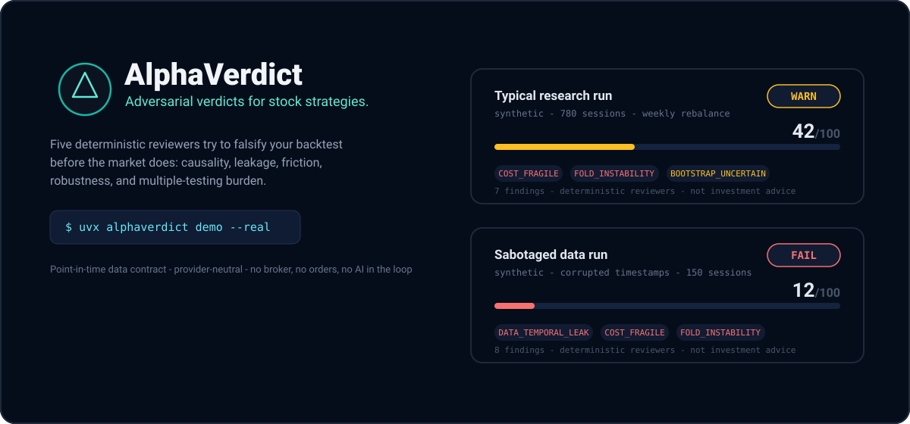

<a href="https://github.com/omrgpt/alpha-verdict">
  
</a>

# AlphaVerdict

**Your LLM can write a trading strategy in 30 seconds. AlphaVerdict tells you if you can trust it.**

Five deterministic reviewers try to falsify your backtest before the market does —
checking causality, look-ahead leakage, survivorship, cost fragility, robustness,
and multiple-testing burden. Every conclusion is a stable finding code linked to
evidence, not prose vibes.

[](https://github.com/omrgpt/alpha-verdict/actions/workflows/ci.yml)
[](https://pypi.org/project/alphaverdict/)

[](LICENSE)
[](SECURITY.md)

---

## See it in 60 seconds

```bash
uvx alphaverdict demo            # synthetic fixture; proves the plumbing
uvx alphaverdict demo --real     # public market data via the bundled reference adapter
```

Every run writes an immutable evidence bundle:

```
demo-runs/<run-id>/
├── report.html      # self-contained human review with the verdict card
├── result.json      # returns, holdings, signals, metrics
├── audit.json       # findings, evidence, recommendations
└── manifest.json    # hashes and reproducibility identity
```

See two real outputs produced by this repository's own build:
[a typical research run](docs/examples/report-pass.html) and a
[sabotaged run](docs/examples/report-fail.html) where we corrupted data timestamps
on purpose — the council caught it instantly.

> [!CAUTION]
> AlphaVerdict is research software, not investment advice. A `PASS` verdict means
> only that this run survived the configured tests.

## Why most backtests are lying to you

Most tools answer: *"What did this strategy return?"*

AlphaVerdict asks the harder question: **"What would have been knowable then,
and which reasons should stop me from believing this result?"**

| Reviewer | Questions it tries to falsify |
| --- | --- |
| Data integrity | Impossible OHLC rows? Undeclared adjustment policy? Survivorship unproven? Synthetic data posing as real? |
| Causality | Do repeated runs change? Do past signals change when future data — or bundle metadata — is corrupted? Does output depend on evaluation order (stale warmup state)? |
| Performance | Sample too small? Sharpe too extreme? Edge too close to friction? One stock dominating contributions? |
| Robustness | Does it die across contiguous folds, cost stress multiples, bootstrap paths, or coarse regimes? |
| Statistics | Does it survive track-record length, sign randomization, deflated Sharpe, and declared search burden? |
| Trials | Does your recorded research history actually contain the number of variants you declared? Is the ledger's hash chain intact? |

Findings are stable machine-readable codes (`COST_FRAGILE`, `DATA_TEMPORAL_LEAK`,
`MULTIPLE_TESTING`, `TRIALS_UNDERDECLARED`, …) with recommendations linked to
evidence. The verdict is deterministic: same inputs, same verdict, every time.

Two features make the audit self-verifying:

- **Trial ledger.** Every run appends itself to a hash-chained `trials.jsonl`
  research diary; the trials reviewer reconciles it against the `n_trials` you
  declare, so Deflated Sharpe reflects evidence instead of self-report.
  [Read how →](docs/trial-ledger.md)
- **Self-Check bias zoo.** `alphaverdict selfcheck` runs nine planted-trap
  cases — metadata look-ahead smuggling, frozen warmup state, ledger tampering,
  and more — and fails if the council misses any of them. The auditor
  continuously tests itself. [Meet the traps →](docs/selfcheck.md)

## Built for the agent era

AlphaVerdict is deliberately AI-free *inside* the loop — and first-class for AI
*around* it:

- **MCP server built in.** Any agent (Claude Desktop, Claude Code, Codex, custom
  clients) can call `run_demo_verdict`, `run_project_verdict`, and
  `explain_finding` as deterministic tools:

  ```bash
  claude mcp add alphaverdict -- uvx alphaverdict mcp
  ```

  Zero extra dependencies; the server is pure stdlib over stdio.
  [Read the MCP guide →](docs/mcp.md)

- **Verdicts on every pull request.** Add one step and every strategy change gets
  an adversarial review comment automatically:

  ```yaml
  - uses: omrgpt/alpha-verdict@main
    with:
      config-path: alphaverdict.yml
  ```

  [Read the Action guide →](docs/github-action.md)

Vibe-coding tools generate strategies faster than anyone can validate them.
AlphaVerdict is the checksum.

## Bring your own research

```bash
uvx alphaverdict init my-research
cd my-research
alphaverdict validate
alphaverdict screen --as-of 2026-08-19 --output runs/screen.json
alphaverdict backtest
```

Your strategy is one ordinary Python class. The same contract drives today's
screen and every historical decision — no separate "backtest version" that can
silently drift.

```python
import pandas as pd

from alphaverdict import ResearchSnapshot, StockStrategy
from alphaverdict.data.technicals import momentum


class Strategy(StockStrategy):
    name = "twelve-month-strength"
    minimum_history = 253

    def score(self, snapshot: ResearchSnapshot) -> pd.DataFrame:
        prices = snapshot.price_history(sessions=253)
        scores = momentum(prices, lookback=252)
        return scores.rename("score").rename_axis("symbol").reset_index()
```

### The point-in-time data contract

AlphaVerdict never chooses or redistributes your provider. Adapters map your own
data into four canonical tables:

| Table | Required temporal meaning |
| --- | --- |
| `prices` | Daily OHLCV at `timestamp`. |
| `features` | Fundamentals/news-derived values with both `observed_at` and `available_at`. |
| `events` | Events with `event_at` and `available_at`. |
| `universe` | Historical membership with effective dates and when membership became knowable. |

A quarter may end March 31 while its filing lands in May: strategies see the
feature in May, never in March. Revisions stay separate rows. Historical universe
membership prevents today's survivors from silently replacing yesterday's
opportunity set.

Start instantly with the bundled reference adapter (`pip install
alphaverdict[real]`), wire in any provider you license via the CSV/Parquet
adapter, or write your own — [data contract](docs/data-contract.md) ·
[adapter guide](docs/adapters.md).

## Where AlphaVerdict sits

Excellent projects already own important categories: [vectorbt](https://github.com/polakowo/vectorbt)
for fast parameter exploration, [backtesting.py](https://github.com/kernc/backtesting.py)
for concise OHLC APIs, [Backtrader](https://github.com/mementum/backtrader) for
event-driven simulation, [Qlib](https://github.com/microsoft/qlib) for AI-oriented
quant platforms, and [LEAN](https://github.com/QuantConnect/Lean) for professional
multi-asset execution.

AlphaVerdict does not try to out-broker or out-optimize them. Its wedge is the
missing layer between point-in-time evidence and an adversarial research verdict.

| Capability | AlphaVerdict | Typical backtest engine |
| --- | --- | --- |
| One strategy contract for screen and history | ✓ | varies |
| Fundamentals/news with knowledge timestamps | first-class | often custom |
| Historical universe membership contract | first-class | varies |
| Future-perturbation causality test | built in | uncommon |
| Deflated Sharpe + multiple-testing burden | built in | rare |
| Deterministic multi-reviewer audit codes | built in | uncommon |
| Works as an MCP tool for agents | built in | rare |
| Broker / live-order surface | **intentionally absent** | often present |

The detailed, evidence-linked assessment lives in
[competitive positioning](docs/competitive-positioning.md). Claims are scoped to
documented public capabilities.

## Architecture

```
Your adapter(s) ──► bitemporal DataBundle ──► ResearchSnapshot(as_of)
                                                    │
Your strategy.py ──────────────────────────────────►│ score stocks
                                                    ▼
                                      daily screen + causal backtest
                                                    │
                    ┌──────────┬──────────┬──────────┼──────────┐
                    ▼          ▼          ▼          ▼          ▼
                  data      causality  performance robustness statistics
                    └──────────┴──────────┴──────────┼──────────┘
                                                    ▼
                                 verdict + evidence + next tests
```

Core execution is deterministic and conservative: signals form after a decision
close, execute at the next available open, hold to the next rebalance open, and
subtract turnover-linked commission plus slippage.

## Security posture

Running a strategy executes trusted local Python; treat configuration from unknown
repositories as code. AlphaVerdict narrows the blast radius: safe YAML parsing
with unknown-key rejection, project-root path confinement, remote URLs rejected
by local adapters, no telemetry, no network downloader, no broker API, and no
hidden model calls. CI includes static analysis, CodeQL, dependency review,
package builds, and a 90% coverage gate. Read [SECURITY.md](SECURITY.md) before
writing an adapter, and the full [threat model](docs/security.md) for details.

## Status and roadmap

AlphaVerdict is `0.2.0` alpha software. The data contract and finding codes aim to
be stable; breaking changes remain possible before `1.0`. The roadmap prioritizes
research validity over feature count — see [ROADMAP.md](ROADMAP.md). We will not
add broker keys, automatic execution, unverifiable "AI picks," bundled proprietary
data, or performance promises. Those exclusions protect the project's identity.

## Contributing

Start with [CONTRIBUTING.md](CONTRIBUTING.md), the [governance model](GOVERNANCE.md),
and [ROADMAP.md](ROADMAP.md). Great first contributions include new invariant
tests, statistical reviewers grounded in primary sources, adapter conformance
fixtures, and clearer explanations of failure.

```bash
python -m pip install -e ".[dev,docs,parquet]"
ruff format --check src tests examples
ruff check src tests examples
mypy src/alphaverdict
pytest
mkdocs build --strict
python -m build
```

Apache-2.0 licensed. See [NOTICE](NOTICE) and [DISCLAIMER.md](DISCLAIMER.md).
